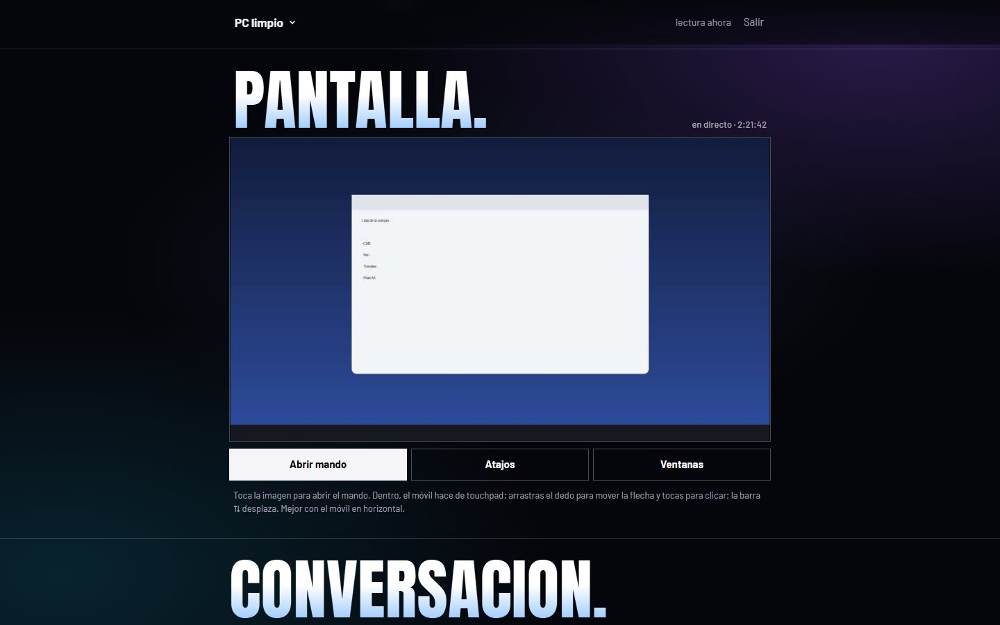
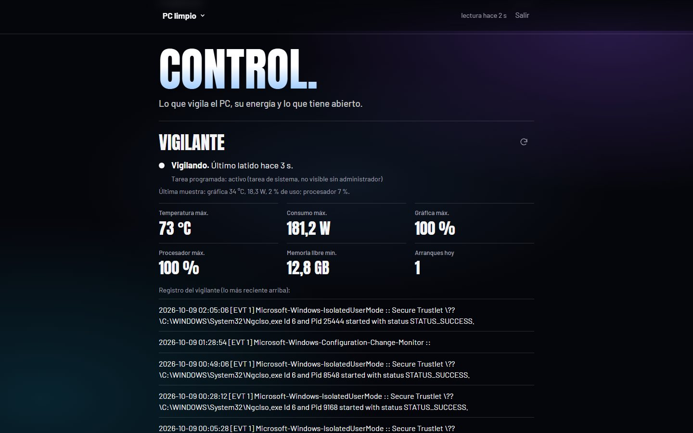
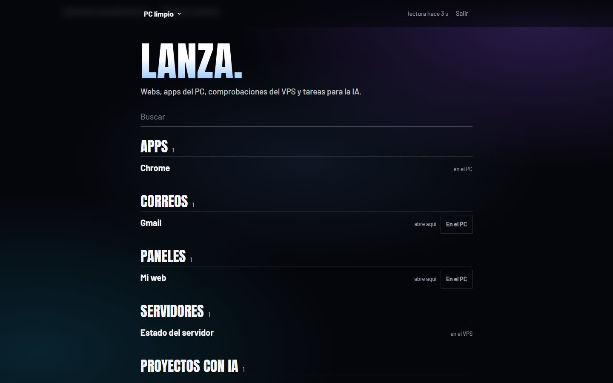

<h1 align="center">Pedro Sánchez</h1>

<p align="center">
  <b>Asistente personal que controla el PC desde el móvil y Telegram.</b><br>
  Habla con él, mira cómo va el equipo, lanza programas y deja que actúe por ti.
</p>

<p align="center">
  
  
  
  
  
</p>

<p align="center">
  
</p>

## Qué hace

- **Habla con él**, por texto o por voz (dictado en el propio PC con Whisper local), y elige quién contesta: **Claude Code**, **Antigravity** o una **IA local**.
- **Dos modos**: *Leer* (mira y propone, no toca nada) y *Actuar* (cambia cosas en el PC, siempre tras confirmar).
- **Mando remoto desde el móvil**: pantalla en directo con touchpad, clics, teclado, volumen, bloquear, apagar o reiniciar.
- **Pulso del PC**: temperatura y consumo de la gráfica, carga, reinicios del día.
- **Vigilante**: avisa si la gráfica se calienta, si el disco se llena o si algo deja de responder.
- **Memoria y agenda**: recuerda hechos, programa avisos y tareas.
- **Lanzadores**: abre programas y webs con un toque, en el PC o en el móvil.
- **Seguro**: solo obedece a tu cuenta de Telegram; el panel web necesita enlace de un solo uso, PIN y código TOTP; sin puertos abiertos (túnel de salida).

<table>
  <tr>
    <td width="50%"><br><sub><b>Hablar</b>: toca y habla, o manos libres</sub></td>
    <td width="50%"><br><sub><b>Conversación</b>: elige Claude Code, Antigravity o IA local, y si solo lee o actúa</sub></td>
  </tr>
  <tr>
    <td width="50%"><br><sub><b>Pantalla</b> en directo y mando con touchpad</sub></td>
    <td width="50%"><br><sub><b>Control</b>: vigilante, máximos del día y eventos</sub></td>
  </tr>
  <tr>
    <td width="50%"><br><sub><b>Lanzar</b>: apps, webs y comprobaciones a un toque</sub></td>
    <td width="50%" align="center"> <br><sub><b>En el móvil</b></sub></td>
  </tr>
</table>

## Puesta en marcha

1. En Telegram, habla con @BotFather → `/newbot` → copia el token.
2. Copia `.env.example` a `.env` y `launchers.example.json` a `launchers.json`, y rellena el token del bot y tu id de Telegram.
3. Abre tu bot en Telegram y pulsa *Iniciar*.
4. `LANZAR.cmd` para probar con ventana. Si todo va bien, `INSTALAR.cmd` lo deja arrancando solo al iniciar sesión.
5. `PONER_PIN.cmd` y `PONER_TOTP.cmd` configuran el acceso al panel web desde el móvil.
6. Opcional: `JARVIS_NOMBRE=TuNombre` en `.env` para que el panel te salude por tu nombre.

## Estructura

| Fichero | Qué es |
|---|---|
| `jarvis.py` | Proceso principal: bot de Telegram, vigilante, agenda y arranque del panel |
| `webpanel.py` | Panel web (API + sesiones, PIN, TOTP, dispositivos) |
| `ui/` | Interfaz web para el móvil (una sola página: Hablar, Pantalla, Conversación, Pulso, Lanzar, Control) |
| `backends.py` | Cerebros alternativos: Antigravity (`agy`), OpenCode + IA local |
| `pedro_mcp.py` | Herramientas propias de Pedro (servidor MCP): ver pantalla, procesos, ventanas, memoria, agenda… |
| `remoto.py`, `voz.py`, `stt.py` | Mando remoto, voz y dictado |
| `sysinfo.py`, `launchers.py`, `agenda.py`, `memoria.py`, `totp.py` | Piezas auxiliares |
| `router/` | Encendido remoto (Wake-on-LAN) desde el router cuando el PC está apagado |

## Pruebas

```bash
python test_web.py        # panel: sesiones, PIN, TOTP, bloqueos, dictado
python test_nuevo.py      # memoria, agenda y herramientas
python jarvis.py --selftest
```

## Notas

- **Coste cero**: el cerebro usa la suscripción de claude.ai; antes de lanzar Claude Code se quita del entorno cualquier clave de API de pago.
- **Antigravity**: en modo *Leer* no puede ejecutar comandos sin consola (los deniega solo), así que para que mire el PC hay que usar *Actuar* o elegir Claude.
- Las variables del `.env` conservan el prefijo `JARVIS_` por compatibilidad.
